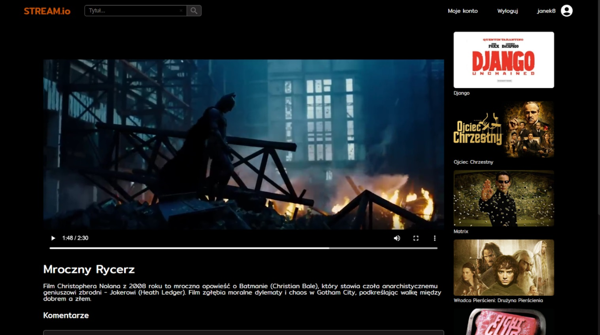

# StreamIo

This app is a video-on-demand platform that lets users stream films by purchasing the appropriate license. It empowers content creators to upload and publish their own videos, while administrators have full control over user accounts. The application was used for a master's thesis to research security methods such as Content Security Policy.

## Homepage

## Movie License

## Movie

## Movie Editor

